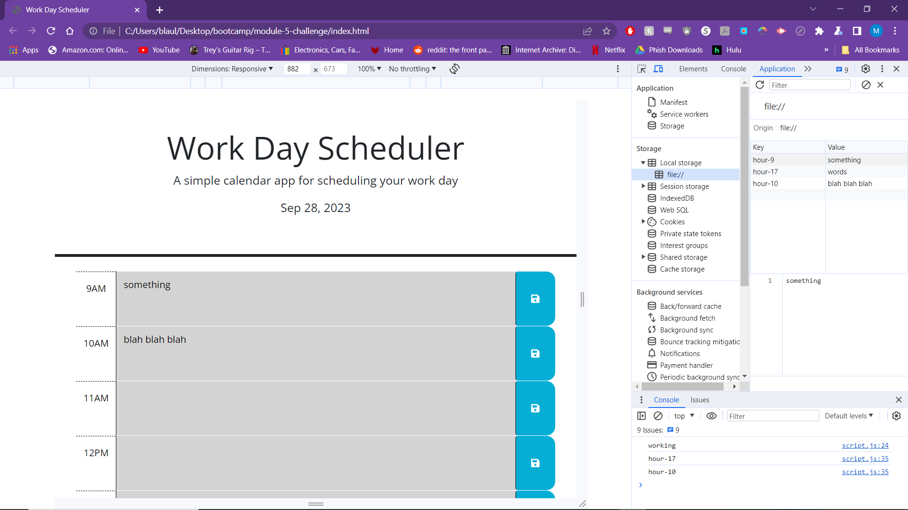
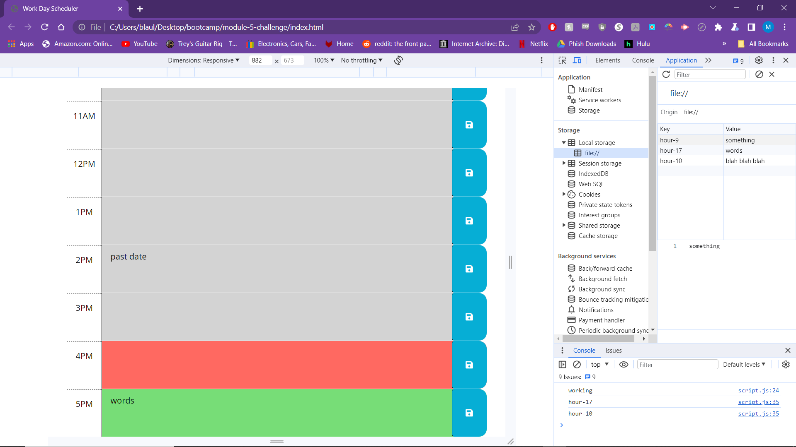

# module-5-challenge
Repo for mod5 challenge

HW 5 went a little bit easier than the last one. I had a bit of a better grasp on what I was doing and what I needed to do. First I got the current hour from DayJS. And that serves as its own function. Next I had to figure out a way to save the text content in the calendar blocks to local storage. This was a little more challenging. I had all of the right components and everything. But it took me a while to realize that I had to target the CLASS of saveBtn instead of just saveBtn. It was literally just hours of me looking up and down the page only to find out I was missing a single period. Coding is soooooooo very very fun somtimes haha. Then I designated each time block as its own value in local storage. After that I had to make a loop to go through all of the time blocks. The classes for the blocks was in CSS. So I made an If statement to add and remove the past present and future classes. I compared everything to the current hour which i got from DayJS. And then I told it to get current hour. 

Screenshots:

Links:
https://maxblaul.github.io/module-5-challenge/
https://github.com/maxblaul/module-5-challenge/settings/pages
